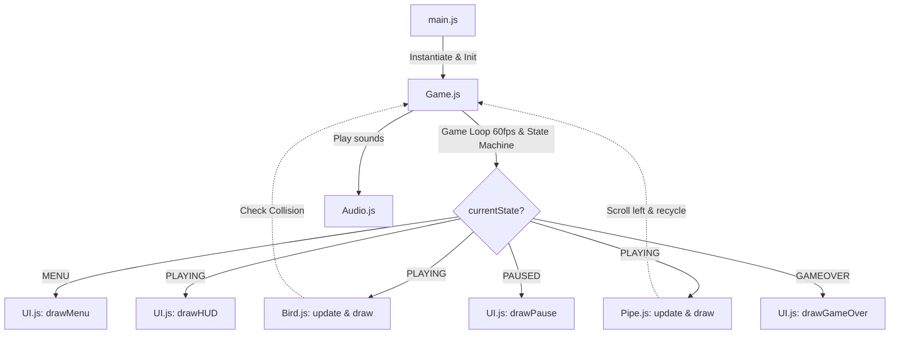

# Custom Flappy Bird Project

Game *side-scrolling endless runner* berbasis web modern yang dioptimalkan untuk perangkat PC/Desktop. Proyek ini memodifikasi mekanik klasik Flappy Bird dengan menambahkan berbagai fitur gameplay canggih, grafis vektor prosedural premium, efek suara interaktif, dan tingkat kesulitan dinamis.

---

## 🚀 Fitur Utama & Keunggulan
1. **Sistem Nyawa (HP):** Pemain dibekali dengan **3 Nyawa (HP)** di awal permainan. Tabrakan tidak memicu kekalahan instan melainkan mengurangi 1 HP dan mengaktifkan **Masa Kebal (Invincibility Frames / i-frames)** selama 1.5 detik dengan visual berkedip untuk memberikan ruang pemulihan bagi pemain.
2. **Kendali Terbang Kontinu (Dual Flight Controls):**
   - **Hop (Ketukan Singkat):** Klik Mouse atau tekan Spacebar singkat untuk melompat dengan ketinggian lompatan statis yang instan.
   - **Fly (Tekan Lama):** Menahan tombol klik/Spacebar memberikan akselerasi vertikal halus ke atas, memungkinkan burung melayang secara kontinu.
3. **Pipa Rintangan Ramping & Celah Lebar:** Lebar pipa disesuaikan menjadi lebih ramping (`40px`) dan lebar celah kosong vertikal diperlebar (`170px`) untuk memberikan rasio traversal yang adil dan memuaskan.
4. **Fase Pipa Bergerak (Dynamic Obstacle Event):** Pada setiap kelipatan jarak 100 meter, game memasuki fase rintangan bergerak vertikal naik-turun secara dinamis selama 15 meter awal.
5. **Tingkat Kesulitan Berjenjang (Speed Difficulty Scaling):** Kecepatan gerak lingkungan bertambah otomatis pada threshold meter tertentu (0-100m, 101-200m, dan 201m+).
6. **Grafis Vektor Prosedural Premium:** Seluruh visual digambar langsung menggunakan API HTML5 Canvas 2D (seperti detail anatomi burung dengan kepakan sayap, awan transparan paralaks, dan ikon hati cinta dengan kurva Bezier) tanpa memuat berkas gambar eksternal.
7. **Pengelola Suara Global:** Web Audio API terintegrasi penuh untuk SFX dan musik latar (BGM), dilengkapi tombol Mute/Unmute instan di HUD dan Menu Utama.

---

## 📂 Struktur Proyek & File
Berikut adalah struktur direktori dari repositori ini. Anda dapat mengklik nama berkas untuk melihat isinya:

* 📄 [index.html](file:///c:/Project/Custom%20Flappy%20Bird%20Project/index.html) - Entry point utama aplikasi, berisi kontainer DOM untuk elemen HTML5 Canvas.
* 📄 [style.css](file:///c:/Project/Custom%20Flappy%20Bird%20Project/style.css) - Styling tata letak, pemusatan canvas (*centering screen*), dan UI canvas.
* 📂 **src/** - Direktori kode program utama berbasis ES6 JavaScript Modules:
  * 📄 [main.js](file:///c:/Project/Custom%20Flappy%20Bird%20Project/src/main.js) - Script inisialisasi awal pasca-pemuatan dokumen dan penghubung dengan file Game.
  * 📄 [Game.js](file:///c:/Project/Custom%20Flappy%20Bird%20Project/src/Game.js) - Pengendali utama (*Master Controller*), loop permainan (Game Loop), state machine, perhitungan skor, difficulty scaling, dan deteksi tabrakan.
  * 📄 [Bird.js](file:///c:/Project/Custom%20Flappy%20Bird%20Project/src/Bird.js) - Logika kalkulasi fisika karakter burung, input penahan klik, i-frames, serta visual anatomi burung.
  * 📄 [Pipe.js](file:///c:/Project/Custom%20Flappy%20Bird%20Project/src/Pipe.js) - Logika pembuatan rintangan pipa, kecepatan gulir horizontal, dan pergerakan linear pipa dinamis.
  * 📄 [UI.js](file:///c:/Project/Custom%20Flappy%20Bird%20Project/src/UI.js) - Modul pasif rendering visual UI (HUD, Hati Merah Bezier, Puffy Clouds, Menu Utama, Layar Pause, dan Layar Game Over).
  * 📄 [Audio.js](file:///c:/Project/Custom%20Flappy%20Bird%20Project/src/Audio.js) - Web Audio API wrapper yang memuat dan mengontrol pemutaran efek suara (SFX) serta musik latar (BGM).
* 📂 **docs/** - Dokumen spesifikasi desain dan analisis proyek lengkap:
  * 📄 [PRD.md](file:///c:/Project/Custom%20Flappy%20Bird%20Project/docs/PRD.md) - Product Requirement Document.
  * 📄 [SRS.md](file:///c:/Project/Custom%20Flappy%20Bird%20Project/docs/SRS.md) - Software Requirements Specification.
  * 📄 [SDD.md](file:///c:/Project/Custom%20Flappy%20Bird%20Project/docs/SDD.md) - System Design Document.
  * 📄 [Task_Breakdown.md](file:///c:/Project/Custom%20Flappy%20Bird%20Project/docs/Task_Breakdown.md) - Backlog & Urutan Tugas AI Agent.
  * 📄 [UI_UX_Flow.md](file:///c:/Project/Custom%20Flappy%20Bird%20Project/docs/UI_UX_Flow.md) - Alur Layar UI dan Panduan Tombol Kontrol.

---

## 🛠️ Cara Menjalankan Game
Proyek ini murni dijalankan pada sisi klien (*client-side*). Anda tidak memerlukan proses instalasi build tools yang rumit:

### Opsi 1: Klik Ganda Langsung (Local File)
Cukup unduh kode sumber repositori ini, cari berkas [index.html](file:///c:/Project/Custom%20Flappy%20Bird%20Project/index.html) di komputer Anda, lalu klik ganda (double-click) untuk membukanya di browser web Anda (Chrome, Edge, Firefox, atau Safari).
> [!NOTE]
> Karena beberapa browser menerapkan kebijakan keamanan ketat (*CORS Policy*) pada ES6 Modules lokal (`type="module"`), Opsi 2 sangat direkomendasikan jika JavaScript tidak termuat otomatis.

### Opsi 2: Menggunakan Server Lokal Ringan (Sangat Direkomendasikan)
Gunakan modul server lokal agar sistem browser dapat memuat ES6 Modules dengan sempurna:
1. **VS Code Live Server:** Jika Anda menggunakan Visual Studio Code, instal ekstensi "Live Server", klik kanan pada [index.html](file:///c:/Project/Custom%20Flappy%20Bird%20Project/index.html), dan pilih **Open with Live Server**.
2. **Python Server:** Jalankan perintah berikut di terminal Anda pada direktori proyek:
   ```bash
   python -m http.server 8000
   ```
   Lalu buka tautan `http://localhost:8000` pada browser Anda.
3. **NodeJS Server:** Jalankan perintah npm berikut:
   ```bash
   npx http-server ./
   ```

---

## ⚙️ Arsitektur & Logika Coding
Bagi pengembang yang ingin mengambil atau memodifikasi kode program, berikut adalah alur dan penjelasan rumusan logika yang digunakan:



### 1. Game State Machine (`Game.js`)
Permainan diatur menggunakan status transisi `currentState` yang melarang eksekusi silang perintah:
* **`MENU`**: Logika game diam. Hanya memproses input tombol *Start Game* dan klik audio mute. Musik latar (BGM) mulai bersuara pasca-interaksi pertama.
* **`PLAYING`**: Loop pergerakan penuh aktif. Fisika burung, laju pipa horizontal, perhitungan skor jarak, dan deteksi tabrakan diperbarui setiap frame.
* **`PAUSED`**: Logika permainan membeku (*freeze*). Menekan tombol `P` pada keyboard bergantian melakukan transisi antara `PLAYING` dan `PAUSED`.
* **`GAMEOVER`**: Dipicu saat sisa HP = 0. Menyimpan High Score di memori runtime dan memunculkan tombol *Restart Game*.

### 2. Rumus Fisika Pergerakan Burung (`Bird.js`)
Kecepatan jatuh burung menggunakan model gravitasi linier yang diperbarui menggunakan Delta Time (`dt` dalam detik) disesuaikan ke basis standar 60 FPS (`timeScale = dt * 60`):
* **Saat tidak ada input (Jatuh Bebas):**
  $$\text{velocityY} = \text{velocityY} + (\text{gravity} \times \text{timeScale})$$
* **Saat melayang (Long Press tombol ditahan):**
  $$\text{velocityY} = \text{velocityY} - (\text{flyAcceleration} \times \text{timeScale})$$
* **Pembatasan Terminal Velocity:** Kecepatan jatuh vertikal dikunci agar tidak melebihi kecepatan terminal (`terminalVelocity = 8.0`) agar tidak jatuh terlalu ekstrem.
* **Flap (Lompat Instan):** Klik tombol memberikan impuls negatif instan ke kecepatan vertikal (`velocityY = -jumpForce`).
* **Nilai Parameter Fisika Terpasang:**
  * `gravity = 0.35`
  * `jumpForce = 5.2`
  * `flyAcceleration = 0.20`

### 3. Logika Spawn & Pergerakan Pipa (`Pipe.js` & `Game.js`)
* **Spawning:** Pipa pertama kali dibuat di ujung kanan canvas (`x = 960px`). Pipa baru berikutnya dilahirkan ketika pipa terakhir dalam array berjalan sejauh $200\text{px}$ melewati batas kanan layar (menjaga jarak horizontal pipa selalu konsisten).
* **Fase Pipa Bergerak Dinamis:**
  Logika event dinamis aktif untuk pipa-pipa baru yang dilahirkan saat jarak bertahan hidup (`currentDistance` dalam Meter) memenuhi persyaratan berikut:
  ```javascript
  const dTrigger = Math.floor(this.currentDistance);
  const isDynamic = (dTrigger % 100 >= 0 && dTrigger % 100 <= 15) && (dTrigger >= 100);
  ```
  Pipa dinamis bergerak vertikal ke atas/bawah secara linear (`verticalSpeed = 0.8`). Jika ketinggian pipa atas (`topHeight`) menyentuh batas `< 50px` atau `> 320px`, variabel arah gerakan `direction` dikalikan `-1` untuk membalik gerakan.

### 4. Algoritma Tabrakan Lingkaran-ke-Kotak (Collision Detection)
Menggunakan algoritma *clamping* teroptimasi untuk menghitung jarak terdekat antara pusat lingkaran burung dengan sisi pembatas persegi panjang pipa:
```javascript
checkCollision(bird, rect) {
    // Cari titik terdekat pada kotak rintangan relatif terhadap pusat lingkaran burung
    const closestX = Math.max(rect.x, Math.min(bird.x, rect.x + rect.width));
    const closestY = Math.max(rect.y, Math.min(bird.y, rect.y + rect.height));

    // Hitung selisih jarak X dan Y
    const distanceX = bird.x - closestX;
    const distanceY = bird.y - closestY;

    // Teorema Pythagoras untuk menentukan persinggungan
    const distanceSquared = (distanceX * distanceX) + (distanceY * distanceY);
    return distanceSquared < (bird.radius * bird.radius);
}
```

### 5. Grafis Vektor Prosedural (`UI.js` & `Bird.js`)
* **Bezier Love Heart (Ikon HUD HP):**
  Ikon hati digambar menggunakan kurva Bezier kubik (`bezierCurveTo()`) untuk lengkungan simetris tanpa file eksternal:
  ```javascript
  ctx.bezierCurveTo(x + size * 0.15, y, x, y + size * 0.15, x, y + size * 0.45);
  ctx.bezierCurveTo(x, y + size * 0.7, x + size * 0.25, y + size * 0.85, topCenterX, y + size);
  ```
* **Puffy Background Clouds (Awan Paralaks):**
  Awan digambar menggunakan gabungan 4 lingkaran berukuran berbeda dengan pergeseran sudut busur bertumpuk (`ctx.arc()`) dengan transparansi `rgba(255, 255, 255, 0.08)`. Awan bergerak lambat (`0.15` - `0.3`) di belakang pipa untuk menciptakan depth visual yang menawan.

---

## 🎮 Kontrol Permainan
| Tombol Input | Aksi / Fungsi |
| :--- | :--- |
| **Klik Kiri Mouse** / **Spacebar** / **Panah Atas** (Tekan sekali) | Burung Melompat (Flap) / Memilih Menu Start dan Restart |
| **Klik Kiri Mouse** / **Spacebar** (Tahan) | Terbang ke atas secara kontinu (Continuous Fly) |
| **Tombol P** (Keyboard) | Menunda (Pause) dan melanjutkan kembali (Resume) permainan |
| **Klik Speaker (HUD/Menu)** | Mematikan (Mute) dan menyalakan kembali (Unmute) seluruh audio game |

Selamat Bermain & Semoga Berhasil Melewati Pipa Dinamis! 🐦✨
